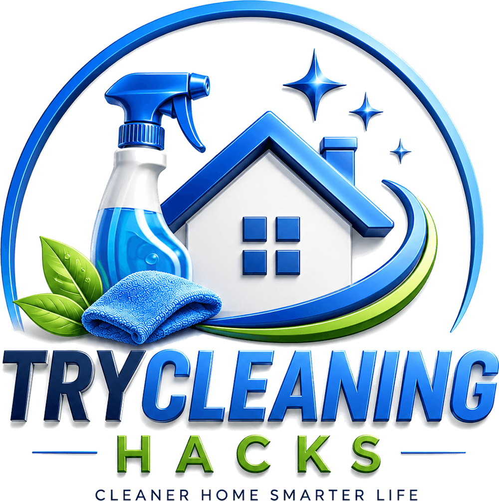

<p align="center">
  <picture>
    <source media="(prefers-color-scheme: dark)" srcset="public/brand/logo-night.png">
    
  </picture>
</p>

<h1 align="center">TryCleaningHacks</h1>

<p align="center">Cleaner home, smarter life.</p>

<p align="center">
  
  
  
  
</p>

🧽 TryCleaningHacks is a content website for people who want fast, practical, and tested home cleaning advice.

🏠 The website helps readers find cleaning hacks for kitchens, bathrooms, laundry, deep cleaning, pest control, and everyday home care.

🔎 Visitors can browse by category, search for specific problems, read step-by-step guides, and subscribe to email updates for new cleaning tips.

📬 The project also includes newsletter signup, analytics, SEO pages, and backend routes for contact, subscriptions, notifications, and email workflows.

## What This Website Is For

✨ This website is built to publish easy cleaning guides that use common products and simple methods.

🛁 It is meant for homeowners, renters, busy families, and anyone who wants a cleaner home without guessing what works.

🧴 The goal is to turn everyday cleaning questions into clear answers, searchable topics, and useful content people can save and come back to.

---

## 🎨 Brand assets

Every logo file the site serves is generated from the masters in `assets/brand/`.
Replace a master and re-run the build to keep every size in sync:

```bash
npm run build:brand
```

The script lifts the logo off its white background, splits the emblem from the
wordmark, and writes:

| File | Used for |
| --- | --- |
| `public/brand/logo.png` | Full stacked lockup, transparent (README, `Organization` structured data) |
| `public/brand/logo-horizontal.png` | Emblem + name side by side, for the navbar and footer |
| `public/brand/logo-mark.png` | Emblem on its own, square |
| `public/brand/logo-wordmark.png` | Name + tagline on its own |
| `public/brand/logo-night*.png` | The same four cuts of the dark master, shown in dark mode |
| `public/brand/icon-{16,32,48,96,192,512}.png` | Favicons, including the icon Google shows beside the search result |
| `public/brand/apple-touch-icon.png` | iOS home screen |
| `public/brand/icon-maskable-512.png` | Android adaptive icon |
| `public/favicon.ico` | 16/32/48 browser tab icon |

Two masters go in: `logo-source.png` (day) and `logo-source-night.png` (the
dark cut). The night one is optional; without it the day assets still build. It
ships with a "NIGHT SHIFT" sub-line under the name, which the generator removes
so both themes show the one brand, closing the tagline back up underneath.

Icons and the favicon always come from the day logo, so the tab and the search
result stay the same whatever theme the reader is using. The generator also
writes `src/data/brand.ts`, so the navbar and footer never hold a hard-coded
size that could drift from the artwork.

Palette, sampled from the logo:

| Color | Hex |
| --- | --- |
| Deep navy (`TRY`) | `#051e47` |
| Primary blue (`CLEANING`) | `#1b7cee` |
| Accent green (`HACKS`) | `#64a512` |

---

## 📄 License

This project is proprietary. All rights reserved © 2025 Fredler Gracia Pierre-Louis.

Unauthorized copying, distribution, or modification of this project, in whole or in part, is strictly prohibited without prior written permission from the owner.

